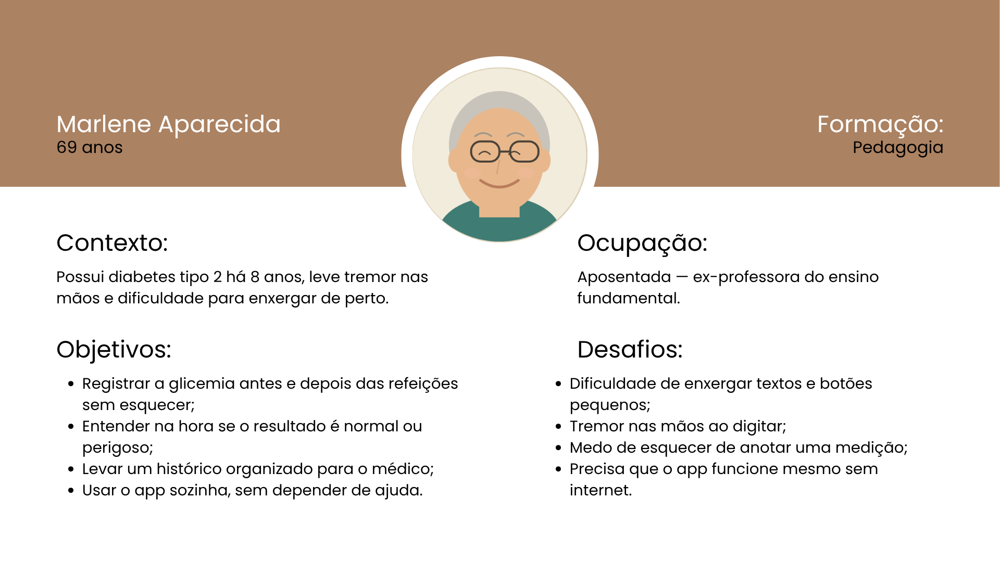
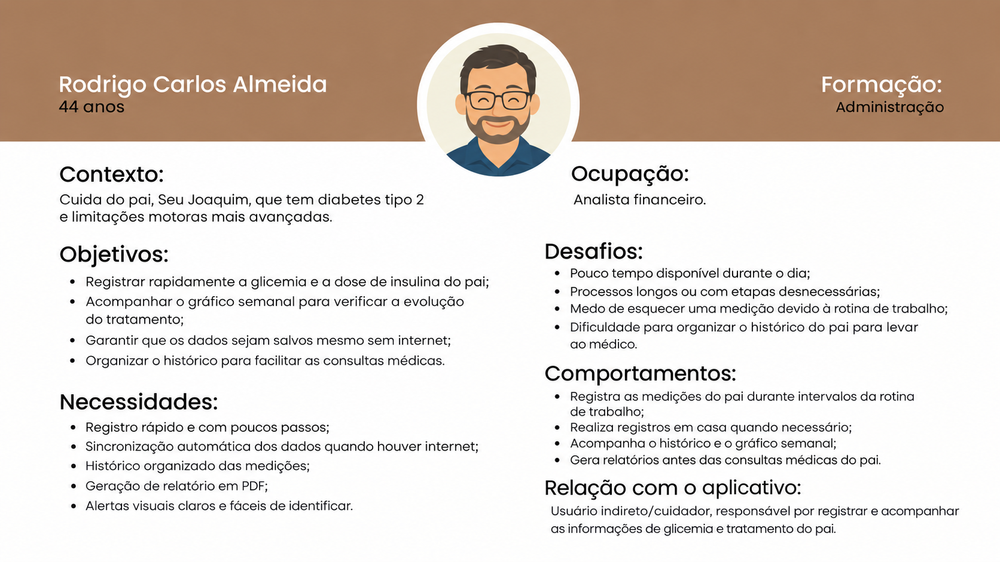

# Personas — GlicoTrack

Atividade 02 — Pesquisa, Benchmark e Personas
Disciplina: Programação para Dispositivos Móveis

As duas personas a seguir foram construídas a partir do estudo de caso ([`estudo-de-caso.md`](estudo-de-caso.md)) e das descobertas da pesquisa ([`pesquisa.md`](pesquisa.md)).

---

## Persona 1 — Marlene Aparecida

- **Nome fictício:** Marlene Aparecida, 69 anos
- **Perfil/contexto:** aposentada, ex-professora do ensino fundamental, formada em Pedagogia. Convive com diabetes tipo 2 há 8 anos, tem leve tremor nas mãos e dificuldade para enxergar de perto. Mede a glicemia em casa e, às vezes, fora dela.

**Objetivos**

- Registrar a glicemia antes e depois das refeições sem esquecer;
- Entender na hora se o resultado é normal ou perigoso;
- Levar um histórico organizado para o médico;
- Usar o app sozinha, sem depender de ajuda.

**Necessidades**

- Interface simples e fácil de entender;
- Textos e botões maiores;
- Funcionamento mesmo sem internet;
- Informações claras sobre os resultados das medições.

**Dores**

- Dificuldade de enxergar textos e botões pequenos;
- Tremor nas mãos ao digitar;
- Medo de esquecer de anotar uma medição;
- Dificuldade para interpretar rapidamente os resultados.

**Comportamentos**

- Realiza medições de glicemia antes e depois das refeições;
- Registra suas medições para acompanhar o histórico;
- Consulta os resultados para saber se estão dentro do esperado;
- Busca utilizar o aplicativo de forma independente.

**Relação com o aplicativo**

Usuária direta: utiliza o aplicativo todos os dias para registrar e acompanhar sua glicemia.

---

## Persona 2 — Rodrigo Carlos Almeida

- **Nome fictício:** Rodrigo Carlos Almeida, 44 anos
- **Perfil/contexto:** analista financeiro, formado em Administração. Cuida do pai, Seu Joaquim, que tem diabetes tipo 2 e limitações motoras mais avançadas. Faz os registros nos intervalos da rotina de trabalho.

**Objetivos**

- Registrar rapidamente a glicemia e a dose de insulina do pai;
- Acompanhar o gráfico semanal para verificar a evolução do tratamento;
- Garantir que os dados sejam salvos mesmo sem internet;
- Organizar o histórico para facilitar as consultas médicas.

**Necessidades**

- Registro rápido e com poucos passos;
- Sincronização automática dos dados quando houver internet;
- Histórico organizado das medições;
- Geração de relatório em PDF;
- Alertas visuais claros e fáceis de identificar.

**Dores**

- Pouco tempo disponível durante o dia;
- Processos longos ou com etapas desnecessárias;
- Medo de esquecer uma medição devido à rotina de trabalho;
- Dificuldade para organizar o histórico do pai para levar ao médico.

**Comportamentos**

- Registra as medições do pai durante intervalos da rotina de trabalho;
- Realiza registros em casa quando necessário;
- Acompanha o histórico e o gráfico semanal;
- Gera relatórios antes das consultas médicas do pai.

**Relação com o aplicativo**

Usuário indireto/cuidador: registra e acompanha as informações de glicemia e tratamento do pai.

---

## Persona prioritária

A persona prioritária do GlicoTrack é a **Persona 1 — Marlene Aparecida**.

**Justificativa da escolha**

1. **Ela representa o público central do estudo de caso.** O projeto foi definido para pessoas com diabetes, em sua maioria idosas, que precisam registrar a própria glicemia. Marlene é a usuária final do dado, não uma intermediária.
2. **Ela é o cenário mais restritivo de acessibilidade.** Tremor nas mãos, dificuldade para enxergar de perto e a necessidade de usar o app sozinha justificam diretamente as restrições obrigatórias do projeto: fontes gigantes, teclado numérico imenso já aberto, botão de salvar como maior elemento da tela, trava de rolagem e cores severas para comunicar o resultado. Um app que funciona bem para Marlene funciona bem para qualquer outro perfil; o contrário não é verdadeiro.
3. **As dores dela atingem o objetivo do produto.** Se Marlene não consegue registrar sozinha, o histórico fica incompleto e o relatório em PDF perde valor clínico — ou seja, o aplicativo falha na sua função principal.
4. **Rodrigo é atendido por consequência.** As necessidades do cuidador (registro rápido, poucos passos, salvamento offline, gráfico semanal e PDF) já são cobertas pelas mesmas decisões de projeto tomadas para Marlene, com a diferença de que ele possui autonomia digital para contornar eventuais dificuldades — Marlene não.

Por isso, todas as decisões de interface, de acessibilidade e de fluxo do GlicoTrack são validadas primeiro pela ótica de Marlene Aparecida.
